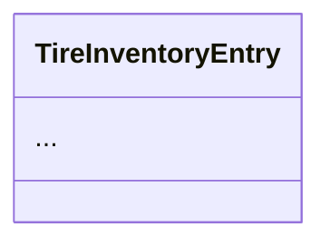

# 🚀 GUÍA DE USO - PROMPTS PARA CLAUDE CODE
## Sistema TRANSER Vórtice - Módulo Tire

**Propósito:** Guía práctica con ejemplos de cómo usar los prompts optimizados

---

## 📦 ARCHIVOS DEL SISTEMA

```
documentos/
├── PROMPT_MASTER_TIRE_MODULE.md      # Prompt principal completo
├── CHECKLIST_VALIDACION.md           # Checklist de 30 preguntas
└── GUIA_USO.md                       # Este archivo (guía práctica)

contexto/
├── CLAUDE.md                         # Contexto general del proyecto
├── Contexto_General.md               # Convenciones y estándares
├── Contexto_Llantas.md               # Contexto específico del módulo
├── Requerimiento_Llantas.md          # Requerimientos funcionales
└── Modelo_ER_Llantas.sql             # Modelo de datos
```

---

## 🎯 PASO 1: CONFIGURACIÓN INICIAL DE CLAUDE CODE

### Opción A: Carga del Contexto Completo

**Primera interacción con Claude Code:**

```
Hola Claude Code,

Voy a proporcionarte el contexto completo del proyecto TRANSER Vórtice.

Por favor, lee los siguientes archivos en orden:

1. /CLAUDE.md (contexto base del proyecto)
2. /docs/Contexto_General.md (convenciones generales)
3. /docs/llantas/Contexto_Llantas.md (contexto específico del módulo)
4. /docs/PROMPT_MASTER_TIRE_MODULE.md (protocolo de trabajo)

Después de leer estos archivos, confirma que entendiste:
- El stack tecnológico
- La arquitectura (Clean Architecture)
- Los módulos existentes (Auth, Users)
- El protocolo de validación antes de desarrollar

Responde con un resumen de lo que entendiste.
```

### Opción B: Carga Paso a Paso

**Si Claude Code tiene problemas con múltiples archivos:**

```
Paso 1: Contexto del Proyecto

[Pegar contenido de CLAUDE.md]

¿Entendiste el contexto? Responde con: "Contexto base confirmado ✅"
```

Luego:

```
Paso 2: Protocolo de Trabajo

[Pegar contenido de PROMPT_MASTER_TIRE_MODULE.md]

¿Entendiste el protocolo de validación? Confirma.
```

---

## 🎯 PASO 2: VERIFICACIÓN DE COMPRENSIÓN

**Después de cargar el contexto, verifica:**

```
Claude Code, antes de comenzar, responde estas preguntas:

1. ¿Cuál es el stack tecnológico del proyecto?
2. ¿Qué arquitectura seguimos?
3. ¿Qué módulos ya están implementados?
4. ¿Qué debo hacer ANTES de escribir código?
5. ¿Cómo se nombra una tabla en PostgreSQL?
6. ¿Cuál es el package base para Java en el módulo Tire?

Si todas son correctas, responde: "✅ Listo para recibir requerimientos"
```

**Respuesta Esperada:**

```
✅ Contexto Confirmado

1. Stack: Java 21 + Spring Boot 3.5 | React 18 + TypeScript | PostgreSQL 18
2. Arquitectura: Clean Architecture / Hexagonal con DDD
3. Implementados: Auth, Users
4. Antes de código: Responder 30 preguntas de validación y obtener confirmación
5. Tablas: plural, snake_case (ej: active_tires)
6. Package: com.transer.vortice.tire.[layer]

✅ Listo para recibir requerimientos
```

INICIAR DESARROLLO DE UN REQUERIMIENTO

### RF-001 -  Gestión de Fichas Técnicas

**Descripción:**  
El sistema debe permitir el registro y mantenimiento de fichas técnicas para cada tipo de llanta.

**Datos de la Ficha Técnica:**
- Código único
- Marca
- Tipo
- Referencia
- Dimensiones (ancho, alto, radio)
- Kilómetros esperados de vida útil
- Rangos de kilometraje (mayor, menor, medio)
- Número de reencauches esperados
- Pérdida esperada (%)
- Total esperado
- Costo por hora
- Profundidades iniciales (PI, PC, PD)
- Información de última compra (cantidad, precio, fecha)
- Proveedores (principal, secundario, último usado)
- Peso


**Validaciones:**
- Código único
- Marca, tipo y referencia deben existir en catálogos
- Kilómetros esperados > 0
- Profundidades iniciales entre 0 y 99.9 mm
- Proveedores deben existir en catálogo


---

## 🎯 PASO 3: INICIAR DESARROLLO DE UN REQUERIMIENTO

### Ejemplo 1: RF-002 - Control de Inventario

**Tu comando:**

```
🎯 INICIAR: RF-002 - Control de Inventario de Llantas

Por favor:
1. Lee el requerimiento RF-002 del archivo Requerimiento_Llantas.md
2. Responde las 30 preguntas de validación
3. Presenta el diseño de la solución
4. Solicita confirmación antes de implementar
```

**Respuesta Esperada de Claude Code:**

```markdown
# ANÁLISIS: RF-002 - Control de Inventario de Llantas

## A. COMPRENSIÓN DEL PROBLEMA DE NEGOCIO

1. **Problema:** El sistema debe controlar las llantas que están en bodega 
   sin montar, permitiendo ingresar nuevas llantas, reencauchar llantas usadas,
   y preparar llantas para instalación...

2. **Actores:**
   - Almacenista: Ingreso y control de inventario
   - Jefe de Taller: Aprobación de reencauches
   - Operarios: Consulta de disponibilidad

3. **Valor:** Optimiza el control de activos inmovilizados, reduce pérdidas
   por desorganización, facilita toma de decisiones de compra...

## B. ALCANCE FUNCIONAL

4. **Casos de uso principales:**
   - UC-INV-001: Registrar ingreso de llanta nueva
   - UC-INV-002: Registrar llanta reencauchada
   - UC-INV-003: Consultar inventario disponible
   - UC-INV-004: Preparar llanta para montaje
   - UC-INV-005: Actualizar localización de llanta

[... continúa con las 30 preguntas ...]

---

## DISEÑO DE SOLUCIÓN

### 1. Aggregate Root y Entidades

**Aggregate Root:** `TireInventory`

**Entidades:**
- `TireInventoryEntry`: Entrada individual en inventario
- `TireSpecification`: Ficha técnica de la llanta

**Value Objects:**
- `TireNumber`: Identificador único de la llanta
- `Generation`: Código de generación (vehículos + reencauches)
- `StorageLocation`: Ubicación en bodega
- `TireValue`: Valor monetario

[... continúa con diseño completo ...]

---

## ❓ CONFIRMACIÓN REQUERIDA

¿Confirmas que el análisis y diseño presentado es correcto y puedo 
proceder con la implementación?
```

### Tu Respuesta (Opciones):

**Opción 1: Aprobar**
```
✅ Confirmado. Procede con la implementación.

Comienza con:
1. Domain entities
2. Repository interfaces
3. Use cases
4. Controllers
5. Frontend
```

**Opción 2: Solicitar Ajustes**
```
Hay algunas dudas:

1. En el Use Case UC-INV-002, ¿cómo se valida que la llanta viene de INTERMEDIO?
2. ¿El valor de la llanta reencauchada debe acumular o reemplazar?
3. ¿Qué pasa si se intenta ingresar un número de llanta duplicado?

Por favor aclara estos puntos antes de implementar.
```

**Opción 3: Solicitar Más Detalle**
```
El análisis es correcto pero necesito más detalle en:

1. El diagrama de estados del inventario
2. Las validaciones específicas de negocio
3. Los DTOs de request/response

Por favor amplía estas secciones.
```

---

## 🎯 PASO 4: IMPLEMENTACIÓN GUIADA

**Después de tu confirmación, Claude Code implementará:**

### Fase 1: Backend - Domain Layer

```
✅ Implementando Domain Layer...

Archivos creados:
- com.transer.vortice.tire.domain.entity.TireInventoryEntry
- com.transer.vortice.tire.domain.valueobject.TireNumber
- com.transer.vortice.tire.domain.valueobject.Generation
- com.transer.vortice.tire.domain.repository.TireInventoryRepository
```

### Fase 2: Backend - Application Layer

```
✅ Implementando Application Layer...

Use Cases:
- RegisterNewTireUseCase
- RegisterRetreadedTireUseCase
- FindAvailableTiresUseCase

DTOs:
- TireInventoryEntryDTO
- RegisterTireRequest
- TireInventoryResponse
```

### Fase 3: Backend - Infrastructure & Presentation

```
✅ Implementando Infrastructure...
- TireInventoryJpaRepository
- TireInventoryEntity (JPA)

✅ Implementando Presentation...
- TireInventoryController
- OpenAPI documentation
```

### Fase 4: Frontend

```
✅ Implementando Frontend...

Components:
- TireInventoryList
- TireInventoryForm
- TireInventoryFilters

Services:
- tireInventoryService.ts

Types:
- tire.types.ts
```

---

## 📋 EJEMPLOS DE CASOS DE USO COMUNES

### Caso 1: Análisis Incompleto

**Problema:** Claude Code no respondió todas las preguntas

**Acción:**
```
Detente. Falta responder las preguntas 15-20 del checklist.
No puedo aprobar sin ese análisis completo.
Por favor, completa las preguntas faltantes.
```

### Caso 2: Ambigüedad en Requerimiento

**Claude Code detecta ambigüedad:**
```
⚠️ AMBIGÜEDAD DETECTADA

En el RF-002, no queda claro:
1. ¿El número de llanta puede reutilizarse después de una baja?
2. ¿El inventario distingue entre llantas importadas vs nacionales?

Necesito confirmación antes de continuar con el diseño.
```

**Tu respuesta:**
```
Aclaraciones:

1. No, el número de llanta es único e irrepetible. Una vez asignado, 
   nunca se reutiliza, ni siquiera después de baja.

2. No es necesario distinguir origen en el inventario. Esa información
   está en la ficha técnica si se requiere.

Con estas aclaraciones, continúa con el análisis completo.
```

### Caso 3: Diseño Requiere Ajustes

**Claude Code presenta diseño:**
```
[... diseño inicial ...]

❓ Confirmación requerida
```

**Tu respuesta con ajustes:**
```
El diseño es bueno pero necesito estos cambios:

1. TireInventoryEntry debe tener un campo adicional: `quality_grade` 
   (A, B, C) para clasificar llantas reencauchadas

2. El Value Object Generation debe validar que el formato sea exactamente
   3 dígitos (regex: ^\d{3}$)

3. Agrega un Use Case adicional: TransferTireLocationUseCase para
   cambiar ubicación dentro de bodega

Con estos ajustes, procede con la implementación.
```

---

## 🛠️ COMANDOS ÚTILES

### Revisar Análisis Previo

```
Claude Code, por favor resume el análisis que hiciste del RF-002.
Quiero revisar las reglas de negocio identificadas.
```

### Verificar Progreso

```
¿Qué porcentaje del RF-002 has completado?
¿Qué falta por implementar?
```

### Solicitar Tests

```
Ahora genera los tests unitarios para:
1. RegisterNewTireUseCase
2. TireNumber value object

Incluye casos happy path y casos de error.
```

### Generar Documentación

```
Genera la documentación OpenAPI/Swagger para los endpoints
del TireInventoryController.

Incluye:
- Descripciones claras
- Ejemplos de request/response
- Códigos de error posibles
```

---

## ⚠️ ERRORES COMUNES Y SOLUCIONES

### Error 1: Claude Code Salta la Validación

**Síntoma:**
```
// Claude Code genera código directamente sin análisis
public class TireInventoryEntry { ... }
```

**Solución:**
```
DETENTE ❌

No has seguido el protocolo. Antes de cualquier código debes:

1. Responder las 30 preguntas de validación
2. Presentar el diseño completo
3. Solicitar mi confirmación explícita

Por favor reinicia el proceso correctamente para RF-002.
```

### Error 2: Respuestas Superficiales

**Síntoma:**
```
1. Problema: Gestionar llantas
2. Actores: Usuarios
3. Valor: Mejora el control
```

**Solución:**
```
Estas respuestas son demasiado superficiales.

Ejemplo de lo que espero para la pregunta 1:

"Problema: El sistema actual no tiene visibilidad del inventario de
llantas en bodega, lo que genera:
- Compras innecesarias por desconocimiento de stock real
- Pérdida de llantas por mala localización física
- Imposibilidad de planificar reencauches con anticipación
- Falta de trazabilidad desde compra hasta instalación"

Por favor reelabora las respuestas con este nivel de detalle.
```

### Error 3: Diseño sin Diagramas

**Síntoma:**
Claude Code describe entidades pero no genera diagrama

**Solución:**
```
El diseño textual es bueno, pero falta el diagrama visual.

Por favor genera un diagrama en formato Mermaid que muestre:

1. Entidades del agregado TireInventory
2. Value Objects
3. Relaciones entre entidades
4. Estados posibles
5. Transiciones de estado

Formato:


---

## 📊 MÉTRICAS DE CALIDAD

Un buen ciclo de desarrollo debe tener:

**Análisis:**
- ✅ 30 preguntas respondidas en detalle
- ✅ Diagrama visual incluido
- ✅ Use Cases con flujos explícitos
- ✅ API especificada completamente

**Diseño:**
- ✅ Aggregate Root identificado correctamente
- ✅ Límites del agregado claros
- ✅ Invariantes documentadas
- ✅ Eventos de dominio definidos

**Implementación:**
- ✅ Código sigue Clean Architecture
- ✅ Tests unitarios >70% cobertura
- ✅ Validaciones implementadas
- ✅ Documentación OpenAPI completa

**Tiempo Estimado por RF:**
- Análisis y Diseño: 30-45 minutos
- Implementación Backend: 2-3 horas
- Implementación Frontend: 1-2 horas
- Tests: 1 hora
- **Total: 4-6 horas por RF**

---

## 🎓 MEJORES PRÁCTICAS

### 1. Sesiones Cortas y Focalizadas

```
✅ BIEN: Un RF a la vez, completamente terminado
❌ MAL: Iniciar múltiples RFs en paralelo sin terminar ninguno
```

### 2. Documentar Decisiones

```
Después de cada RF implementado:

Claude Code, documenta las decisiones técnicas tomadas:
1. ¿Por qué elegiste X patrón sobre Y?
2. ¿Qué trade-offs consideraste?
3. ¿Qué refactoring futuro recomiendas?

Guarda esto en: docs/decisiones/RF-002-decisiones.md
```

### 3. Review Incremental

```
Después de completar Domain + Application:

Antes de continuar con Infrastructure, revisemos:
1. ¿Las entidades de dominio están bien diseñadas?
2. ¿Los Use Cases validan todas las invariantes?
3. ¿Los DTOs exponen lo necesario sin acoplar al dominio?

Genera un resumen para que yo revise.
```

---

## 🚀 FLUJO COMPLETO - EJEMPLO REAL

### Sesión Completa: RF-002

```
[Inicio: 9:00 AM]

TÚ:
🎯 INICIAR: RF-002 - Control de Inventario de Llantas

[9:00-9:30 AM: Análisis]
CLAUDE CODE: [Responde 30 preguntas + diseño]

TÚ:
✅ Confirmado. Procede con implementación.
Prioridad: Domain → Application → Infrastructure → Presentation

[9:30-10:30 AM: Backend Domain + Application]
CLAUDE CODE: [Implementa entidades, value objects, use cases]

TÚ:
Pausa. Revisemos lo hecho antes de continuar.
Muéstrame:
1. La estructura de TireInventoryEntry
2. Las validaciones de TireNumber
3. El flujo de RegisterNewTireUseCase

[10:30-10:45 AM: Review Intermedio]
CLAUDE CODE: [Muestra código implementado]

TÚ:
Perfecto. Continúa con Infrastructure y Presentation.

[10:45-11:30 AM: Backend Infrastructure + Presentation]
CLAUDE CODE: [Implementa JPA, repository, controller]

[11:30-12:00 PM: Tests Backend]
TÚ:
Ahora genera tests completos para:
- TireNumber (value object)
- RegisterNewTireUseCase
- TireInventoryController (integration test)

[12:00-1:00 PM: Break]

[1:00-2:00 PM: Frontend]
TÚ:
Continuemos con el frontend. Implementa:
1. Types (TypeScript interfaces)
2. Service layer
3. React Query hooks
4. Componentes de UI

[2:00-2:30 PM: Review Final]
TÚ:
Genera un resumen completo del RF-002:
- ¿Qué se implementó?
- ¿Qué tests se crearon?
- ¿Qué endpoints quedaron disponibles?
- ¿Hay algo pendiente o tech debt?

[Fin: 2:30 PM]
Total: 5.5 horas para RF-002 completo
```

---

## 📞 SOPORTE Y RECURSOS

### Si Claude Code se Pierde

```
Claude Code, parece que perdiste el contexto.

Por favor, vuelve a leer:
1. /docs/PROMPT_MASTER_TIRE_MODULE.md
2. /docs/CHECKLIST_VALIDACION.md

Y confirma que recuperaste el protocolo de trabajo.
```

### Logging de Sesiones

```
Al final de cada sesión:

Claude Code, genera un log de esta sesión:
- Requerimientos trabajados
- Archivos creados/modificados
- Decisiones técnicas tomadas
- Pendientes para próxima sesión

Formato: docs/logs/sesion-2026-01-26.md
```

---

## ✅ CHECKLIST DE INICIO DE SESIÓN

Antes de cada sesión de desarrollo:

```
- [ ] Claude Code tiene contexto cargado
- [ ] Protocolo de validación confirmado
- [ ] Documentos de requerimientos accesibles
- [ ] Rama de Git actualizada
- [ ] Entorno de desarrollo funcionando
- [ ] Tiempo disponible: mínimo 2 horas
```

---

**🎯 ¡CON ESTA GUÍA ESTÁS LISTO PARA DESARROLLAR CON EXCELENCIA! 🚀**

**Versión:** 1.0  
**Última Actualización:** 2026-01-26  
**Autor:** Equipo TRANSER Vórtice
