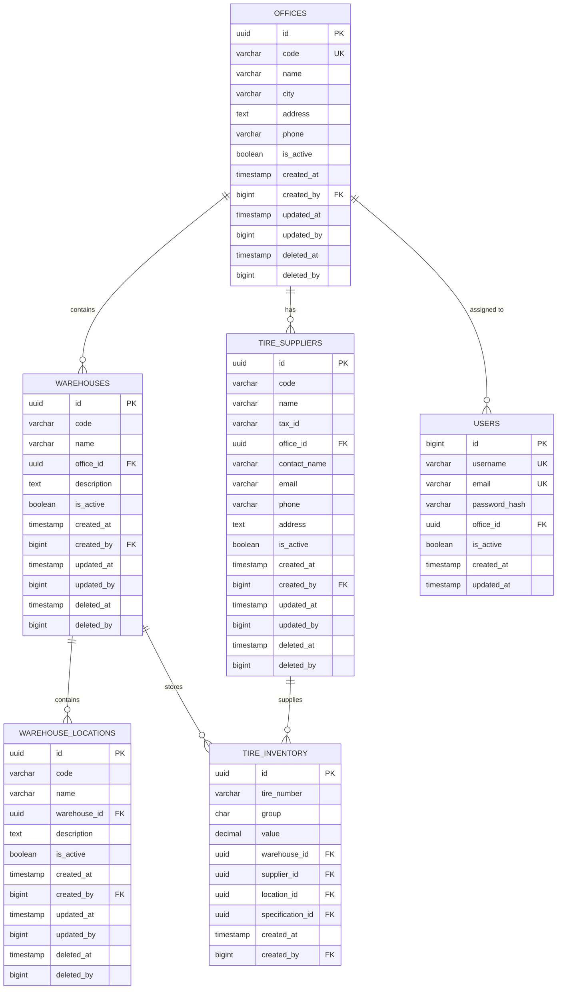

# Esquema de Base de Datos: Estructura Organizacional Multi-Sede

**Versión:** 1.0
**Fecha:** 27 de Enero de 2026
**Módulo:** Organizational Structure (Prerequisito de todos los módulos)

---

## 📋 TABLA DE CONTENIDO

1. [Introducción](#1-introducción)
2. [Diagrama ER](#2-diagrama-er)
3. [Definición de Tablas](#3-definición-de-tablas)
4. [Relaciones y Constraints](#4-relaciones-y-constraints)
5. [Índices](#5-índices)
6. [Row-Level Security](#6-row-level-security)
7. [Scripts de Migración](#7-scripts-de-migración)

---

## 1. INTRODUCCIÓN

### 1.1 Propósito

Este documento define el esquema de base de datos para la estructura organizacional multi-sede del sistema TRANSER Vórtice. Esta estructura es un **prerequisito crítico** para todos los módulos funcionales.

### 1.2 Jerarquía Organizacional

```
EMPRESA (TRANSER)
    │
    ├── OFICINA 1 (ej: Bogotá)
    │       │
    │       ├── ALMACÉN 1 (Almacén Principal)
    │       │       ├── UBICACIÓN 1 (Estante A1)
    │       │       ├── UBICACIÓN 2 (Estante A2)
    │       │       └── UBICACIÓN 3 (Zona de Trabajo)
    │       │
    │       ├── ALMACÉN 2 (Almacén Taller)
    │       │       └── UBICACIÓN 1 (Bahía 1)
    │       │
    │       └── PROVEEDORES (Proveedor B-01, Proveedor B-02)
    │
    └── OFICINA 2 (ej: Medellín)
            │
            ├── ALMACÉN 1 (Almacén Principal)
            │       └── UBICACIÓN 1 (Estante M1)
            │
            └── PROVEEDORES (Proveedor M-01)
```

### 1.3 Principios de Diseño

- ✅ **Aislamiento de Datos:** Cada oficina opera de forma independiente
- ✅ **Integridad Referencial:** Constraints garantizan consistencia
- ✅ **Soft Delete:** No se eliminan físicamente los registros
- ✅ **Auditoría Completa:** Tracking de creación y modificación
- ✅ **Row-Level Security:** Filtrado automático por oficina del usuario
- ✅ **Unicidad Contextual:** Códigos únicos dentro de su contexto (ej: código de almacén único por oficina)

---

## 2. DIAGRAMA ER

### 2.1 Diagrama Conceptual



---

## 3. DEFINICIÓN DE TABLAS

### 3.1 Tabla: `offices` (Oficinas/Sedes)

**Descripción:** Representa cada sede u oficina de la empresa.

```sql
CREATE TABLE offices (
    -- Primary Key
    id UUID PRIMARY KEY DEFAULT gen_random_uuid(),

    -- Campos de negocio
    code VARCHAR(10) NOT NULL UNIQUE,
    name VARCHAR(100) NOT NULL,
    city VARCHAR(50) NOT NULL,
    address TEXT,
    phone VARCHAR(20),

    -- Estado
    is_active BOOLEAN NOT NULL DEFAULT true,

    -- Auditoría
    created_at TIMESTAMP WITH TIME ZONE NOT NULL DEFAULT CURRENT_TIMESTAMP,
    created_by BIGINT NOT NULL REFERENCES users(id),
    updated_at TIMESTAMP WITH TIME ZONE,
    updated_by BIGINT REFERENCES users(id),
    deleted_at TIMESTAMP WITH TIME ZONE,
    deleted_by BIGINT REFERENCES users(id),

    -- Constraints
    CONSTRAINT chk_office_code_format CHECK (code ~ '^[A-Z0-9]{2,10}$'),
    CONSTRAINT chk_office_name_not_empty CHECK (TRIM(name) <> ''),
    CONSTRAINT chk_office_city_not_empty CHECK (TRIM(city) <> '')
);

-- Comentarios
COMMENT ON TABLE offices IS 'Sedes u oficinas de la empresa';
COMMENT ON COLUMN offices.code IS 'Código único de la oficina (ej: BOG, MED, CALI)';
COMMENT ON COLUMN offices.name IS 'Nombre de la oficina (ej: Bogotá - Sede Principal)';
COMMENT ON COLUMN offices.city IS 'Ciudad donde se ubica la oficina';
```

**Reglas de Negocio:**
- `code`: Debe ser único en todo el sistema, formato alfanumérico mayúsculas
- `name` y `city`: Obligatorios, no pueden estar vacíos
- `is_active`: Solo oficinas activas pueden tener operaciones nuevas
- Soft delete: `deleted_at IS NULL` indica oficina activa

---

### 3.2 Tabla: `warehouses` (Almacenes)

**Descripción:** Almacenes dentro de una oficina. Una oficina puede tener múltiples almacenes.

```sql
CREATE TABLE warehouses (
    -- Primary Key
    id UUID PRIMARY KEY DEFAULT gen_random_uuid(),

    -- Campos de negocio
    code VARCHAR(10) NOT NULL,
    name VARCHAR(100) NOT NULL,
    description TEXT,

    -- Relación con oficina
    office_id UUID NOT NULL REFERENCES offices(id),

    -- Estado
    is_active BOOLEAN NOT NULL DEFAULT true,

    -- Auditoría
    created_at TIMESTAMP WITH TIME ZONE NOT NULL DEFAULT CURRENT_TIMESTAMP,
    created_by BIGINT NOT NULL REFERENCES users(id),
    updated_at TIMESTAMP WITH TIME ZONE,
    updated_by BIGINT REFERENCES users(id),
    deleted_at TIMESTAMP WITH TIME ZONE,
    deleted_by BIGINT REFERENCES users(id),

    -- Constraints
    CONSTRAINT uk_warehouse_office_code UNIQUE(office_id, code),
    CONSTRAINT chk_warehouse_code_format CHECK (code ~ '^[A-Z0-9]{2,10}$'),
    CONSTRAINT chk_warehouse_name_not_empty CHECK (TRIM(name) <> '')
);

-- Comentarios
COMMENT ON TABLE warehouses IS 'Almacenes de cada oficina';
COMMENT ON COLUMN warehouses.code IS 'Código del almacén (único por oficina)';
COMMENT ON COLUMN warehouses.office_id IS 'Oficina a la que pertenece el almacén';
COMMENT ON CONSTRAINT uk_warehouse_office_code ON warehouses IS 'El código de almacén debe ser único dentro de la oficina';
```

**Reglas de Negocio:**
- `code`: Único dentro de la oficina (no globalmente)
- El mismo código puede existir en diferentes oficinas (ej: "PRIN" en Bogotá y "PRIN" en Medellín)
- `office_id`: Obligatorio, debe ser oficina activa
- Un almacén pertenece a UNA SOLA oficina

---

### 3.3 Tabla: `warehouse_locations` (Ubicaciones dentro del Almacén)

**Descripción:** Ubicaciones físicas específicas dentro de un almacén (estantes, zonas, bahías).

```sql
CREATE TABLE warehouse_locations (
    -- Primary Key
    id UUID PRIMARY KEY DEFAULT gen_random_uuid(),

    -- Campos de negocio
    code VARCHAR(10) NOT NULL,
    name VARCHAR(100),
    description TEXT,

    -- Relación con almacén
    warehouse_id UUID NOT NULL REFERENCES warehouses(id),

    -- Estado
    is_active BOOLEAN NOT NULL DEFAULT true,

    -- Auditoría
    created_at TIMESTAMP WITH TIME ZONE NOT NULL DEFAULT CURRENT_TIMESTAMP,
    created_by BIGINT NOT NULL REFERENCES users(id),
    updated_at TIMESTAMP WITH TIME ZONE,
    updated_by BIGINT REFERENCES users(id),
    deleted_at TIMESTAMP WITH TIME ZONE,
    deleted_by BIGINT REFERENCES users(id),

    -- Constraints
    CONSTRAINT uk_location_warehouse_code UNIQUE(warehouse_id, code),
    CONSTRAINT chk_location_code_format CHECK (code ~ '^[A-Z0-9\-]{1,10}$')
);

-- Comentarios
COMMENT ON TABLE warehouse_locations IS 'Ubicaciones físicas dentro de cada almacén';
COMMENT ON COLUMN warehouse_locations.code IS 'Código de la ubicación (único por almacén)';
COMMENT ON COLUMN warehouse_locations.warehouse_id IS 'Almacén al que pertenece la ubicación';
COMMENT ON CONSTRAINT uk_location_warehouse_code ON warehouse_locations IS 'El código de ubicación debe ser único dentro del almacén';
```

**Reglas de Negocio:**
- `code`: Único dentro del almacén
- `warehouse_id`: Obligatorio
- Una ubicación pertenece a UN SOLO almacén
- `name` es opcional (puede inferirse del código)

---

### 3.4 Tabla: `tire_suppliers` (Proveedores de Llantas)

**Descripción:** Proveedores de llantas específicos por oficina.

```sql
CREATE TABLE tire_suppliers (
    -- Primary Key
    id UUID PRIMARY KEY DEFAULT gen_random_uuid(),

    -- Campos de negocio
    code VARCHAR(10) NOT NULL,
    name VARCHAR(100) NOT NULL,
    tax_id VARCHAR(20) NOT NULL,

    -- Relación con oficina
    office_id UUID NOT NULL REFERENCES offices(id),

    -- Información de contacto
    contact_name VARCHAR(100),
    email VARCHAR(100),
    phone VARCHAR(20),
    address TEXT,

    -- Estado
    is_active BOOLEAN NOT NULL DEFAULT true,

    -- Auditoría
    created_at TIMESTAMP WITH TIME ZONE NOT NULL DEFAULT CURRENT_TIMESTAMP,
    created_by BIGINT NOT NULL REFERENCES users(id),
    updated_at TIMESTAMP WITH TIME ZONE,
    updated_by BIGINT REFERENCES users(id),
    deleted_at TIMESTAMP WITH TIME ZONE,
    deleted_by BIGINT REFERENCES users(id),

    -- Constraints
    CONSTRAINT uk_supplier_office_code UNIQUE(office_id, code),
    CONSTRAINT chk_supplier_code_format CHECK (code ~ '^[A-Z0-9\-]{2,10}$'),
    CONSTRAINT chk_supplier_name_not_empty CHECK (TRIM(name) <> ''),
    CONSTRAINT chk_supplier_tax_id_not_empty CHECK (TRIM(tax_id) <> ''),
    CONSTRAINT chk_supplier_email_format CHECK (email IS NULL OR email ~* '^[A-Za-z0-9._%+-]+@[A-Za-z0-9.-]+\.[A-Za-z]{2,}$')
);

-- Comentarios
COMMENT ON TABLE tire_suppliers IS 'Proveedores de llantas por oficina';
COMMENT ON COLUMN tire_suppliers.code IS 'Código del proveedor (único por oficina)';
COMMENT ON COLUMN tire_suppliers.tax_id IS 'NIT o identificación tributaria';
COMMENT ON COLUMN tire_suppliers.office_id IS 'Oficina a la que pertenece el proveedor';
COMMENT ON CONSTRAINT uk_supplier_office_code ON tire_suppliers IS 'El código de proveedor debe ser único dentro de la oficina';
```

**Reglas de Negocio:**
- `code`: Único dentro de la oficina
- `tax_id`: Obligatorio (NIT o RUC)
- Un proveedor pertenece a UNA SOLA oficina
- Si un mismo proveedor real opera en varias oficinas, debe registrarse por separado en cada una
- `email`: Validación de formato si se proporciona

---

### 3.5 Modificación a Tabla: `users`

**Descripción:** Agregar campo `office_id` a usuarios existentes.

```sql
-- Agregar columna office_id
ALTER TABLE users
ADD COLUMN office_id UUID REFERENCES offices(id);

-- Hacer obligatorio después de migración de datos
-- ALTER TABLE users
-- ALTER COLUMN office_id SET NOT NULL;

-- Comentario
COMMENT ON COLUMN users.office_id IS 'Oficina a la que está asignado el usuario';
```

**Reglas de Negocio:**
- Todo usuario debe estar asignado a una oficina
- Los usuarios ven solo datos de su oficina (via RLS)
- Usuarios con `ROLE_ADMIN_NATIONAL` pueden ver todas las oficinas

---

## 4. RELACIONES Y CONSTRAINTS

### 4.1 Jerarquía de Relaciones

```
offices (1) ──> (N) warehouses
warehouses (1) ──> (N) warehouse_locations
offices (1) ──> (N) tire_suppliers
offices (1) ──> (N) users
```

### 4.2 Constraints de Integridad Referencial

**Reglas de Eliminación (ON DELETE):**

```sql
-- Oficina NO puede eliminarse si tiene almacenes, proveedores o usuarios
-- Se maneja via soft delete (deleted_at)

-- Almacén NO puede eliminarse si tiene ubicaciones o inventario
-- Se maneja via soft delete (deleted_at)

-- Ubicación NO puede eliminarse si tiene llantas asociadas
-- Se maneja via soft delete (deleted_at)

-- Proveedor NO puede eliminarse si tiene compras asociadas
-- Se maneja via soft delete (deleted_at)
```

### 4.3 Constraints de Unicidad Contextual

```sql
-- Código de oficina: único globalmente
ALTER TABLE offices ADD CONSTRAINT uk_office_code UNIQUE(code);

-- Código de almacén: único por oficina
ALTER TABLE warehouses ADD CONSTRAINT uk_warehouse_office_code UNIQUE(office_id, code);

-- Código de ubicación: único por almacén
ALTER TABLE warehouse_locations ADD CONSTRAINT uk_location_warehouse_code UNIQUE(warehouse_id, code);

-- Código de proveedor: único por oficina
ALTER TABLE tire_suppliers ADD CONSTRAINT uk_supplier_office_code UNIQUE(office_id, code);
```

---

## 5. ÍNDICES

### 5.1 Índices de Performance

```sql
-- Índices para búsquedas frecuentes
CREATE INDEX idx_warehouses_office ON warehouses(office_id) WHERE deleted_at IS NULL;
CREATE INDEX idx_warehouse_locations_warehouse ON warehouse_locations(warehouse_id) WHERE deleted_at IS NULL;
CREATE INDEX idx_tire_suppliers_office ON tire_suppliers(office_id) WHERE deleted_at IS NULL;
CREATE INDEX idx_users_office ON users(office_id) WHERE is_active = true;

-- Índices para códigos (búsquedas por código)
CREATE INDEX idx_offices_code ON offices(code) WHERE deleted_at IS NULL;
CREATE INDEX idx_warehouses_code ON warehouses(office_id, code) WHERE deleted_at IS NULL;
CREATE INDEX idx_tire_suppliers_code ON tire_suppliers(office_id, code) WHERE deleted_at IS NULL;

-- Índices para auditoría
CREATE INDEX idx_offices_created_at ON offices(created_at);
CREATE INDEX idx_warehouses_created_at ON warehouses(created_at);
CREATE INDEX idx_tire_suppliers_created_at ON tire_suppliers(created_at);
```

### 5.2 Índices para RLS

```sql
-- Índice para optimizar get_user_office_id()
CREATE INDEX idx_users_id_office ON users(id, office_id) WHERE is_active = true;
```

---

## 6. ROW-LEVEL SECURITY

### 6.1 Funciones de Utilidad

```sql
-- Función para obtener office_id del usuario actual
CREATE OR REPLACE FUNCTION get_user_office_id()
RETURNS UUID AS $$
DECLARE
    v_office_id UUID;
BEGIN
    SELECT office_id INTO v_office_id
    FROM users
    WHERE id = current_setting('app.current_user_id', true)::BIGINT;
    RETURN v_office_id;
EXCEPTION
    WHEN OTHERS THEN
        RETURN NULL;
END;
$$ LANGUAGE plpgsql STABLE SECURITY DEFINER;

COMMENT ON FUNCTION get_user_office_id() IS 'Obtiene el office_id del usuario actual desde la sesión';

-- Función para verificar si el usuario tiene un rol específico
CREATE OR REPLACE FUNCTION current_user_has_role(role_name TEXT)
RETURNS BOOLEAN AS $$
DECLARE
    has_role BOOLEAN;
BEGIN
    SELECT EXISTS (
        SELECT 1
        FROM users u
        JOIN user_roles ur ON u.id = ur.user_id
        JOIN roles r ON ur.role_id = r.id
        WHERE u.id = current_setting('app.current_user_id', true)::BIGINT
          AND r.name = role_name
          AND u.is_active = true
    ) INTO has_role;
    RETURN COALESCE(has_role, false);
EXCEPTION
    WHEN OTHERS THEN
        RETURN false;
END;
$$ LANGUAGE plpgsql STABLE SECURITY DEFINER;

COMMENT ON FUNCTION current_user_has_role(TEXT) IS 'Verifica si el usuario actual tiene un rol específico';
```

### 6.2 Políticas RLS

```sql
-- RLS para warehouses
ALTER TABLE warehouses ENABLE ROW LEVEL SECURITY;

CREATE POLICY warehouses_office_isolation ON warehouses
    FOR ALL
    TO authenticated_user
    USING (
        current_user_has_role('ROLE_ADMIN_NATIONAL')
        OR
        office_id = get_user_office_id()
    );

COMMENT ON POLICY warehouses_office_isolation ON warehouses IS 'Filtrado automático por oficina del usuario';

-- RLS para warehouse_locations
ALTER TABLE warehouse_locations ENABLE ROW LEVEL SECURITY;

CREATE POLICY locations_office_isolation ON warehouse_locations
    FOR ALL
    TO authenticated_user
    USING (
        current_user_has_role('ROLE_ADMIN_NATIONAL')
        OR
        warehouse_id IN (
            SELECT id FROM warehouses
            WHERE office_id = get_user_office_id()
              AND deleted_at IS NULL
        )
    );

-- RLS para tire_suppliers
ALTER TABLE tire_suppliers ENABLE ROW LEVEL SECURITY;

CREATE POLICY suppliers_office_isolation ON tire_suppliers
    FOR ALL
    TO authenticated_user
    USING (
        current_user_has_role('ROLE_ADMIN_NATIONAL')
        OR
        office_id = get_user_office_id()
    );

-- Nota: offices NO tiene RLS (usuarios solo operan en su oficina, no la ven como dato)
```

---

## 7. SCRIPTS DE MIGRACIÓN

### 7.1 Migración Inicial (Crear Oficina Principal)

```sql
-- Script de migración: 001_create_organizational_structure.sql

BEGIN;

-- 1. Crear oficina principal
INSERT INTO offices (id, code, name, city, is_active, created_at, created_by)
VALUES (
    'a0000000-0000-0000-0000-000000000001'::UUID,
    'MAIN',
    'Oficina Principal',
    'Bogotá',
    true,
    CURRENT_TIMESTAMP,
    1  -- Usuario de sistema
);

-- 2. Crear almacén principal
INSERT INTO warehouses (id, code, name, office_id, description, is_active, created_at, created_by)
VALUES (
    'b0000000-0000-0000-0000-000000000001'::UUID,
    'PRIN',
    'Almacén Principal',
    'a0000000-0000-0000-0000-000000000001'::UUID,
    'Almacén principal de la oficina',
    true,
    CURRENT_TIMESTAMP,
    1
);

-- 3. Migrar ubicaciones desde LOCALIZA legacy
INSERT INTO warehouse_locations (code, name, warehouse_id, is_active, created_at, created_by)
SELECT
    l.cod_local,
    l.descri,
    'b0000000-0000-0000-0000-000000000001'::UUID,
    CASE WHEN l.estado = 'A' THEN true ELSE false END,
    CURRENT_TIMESTAMP,
    1
FROM localiza l
WHERE l.cod_local IS NOT NULL;

-- 4. Migrar proveedores desde PROVEEDORES_LLANTAS legacy
INSERT INTO tire_suppliers (code, name, tax_id, office_id, contact_name, email, phone, address, is_active, created_at, created_by)
SELECT
    p.codigopro,
    p.nombre,
    p.nit,
    'a0000000-0000-0000-0000-000000000001'::UUID,
    p.contacto,
    p.email,
    p.telefono,
    p.direccion,
    CASE WHEN p.estado = 'A' THEN true ELSE false END,
    CURRENT_TIMESTAMP,
    1
FROM proveedores_llantas p
WHERE p.codigopro IS NOT NULL;

-- 5. Actualizar usuarios con office_id
UPDATE users
SET office_id = 'a0000000-0000-0000-0000-000000000001'::UUID
WHERE office_id IS NULL;

-- 6. Hacer obligatorio office_id en users
ALTER TABLE users ALTER COLUMN office_id SET NOT NULL;

COMMIT;
```

### 7.2 Validación Post-Migración

```sql
-- Verificar que todos los usuarios tengan office_id
SELECT COUNT(*) AS users_without_office
FROM users
WHERE office_id IS NULL;
-- Debe retornar 0

-- Verificar que todas las ubicaciones estén asociadas a almacenes
SELECT COUNT(*) AS locations_without_warehouse
FROM warehouse_locations
WHERE warehouse_id IS NULL;
-- Debe retornar 0

-- Verificar que todos los proveedores estén asociados a oficinas
SELECT COUNT(*) AS suppliers_without_office
FROM tire_suppliers
WHERE office_id IS NULL;
-- Debe retornar 0

-- Estadísticas
SELECT
    o.name AS office_name,
    COUNT(DISTINCT w.id) AS warehouses_count,
    COUNT(DISTINCT wl.id) AS locations_count,
    COUNT(DISTINCT ts.id) AS suppliers_count
FROM offices o
LEFT JOIN warehouses w ON o.id = w.office_id AND w.deleted_at IS NULL
LEFT JOIN warehouse_locations wl ON w.id = wl.warehouse_id AND wl.deleted_at IS NULL
LEFT JOIN tire_suppliers ts ON o.id = ts.office_id AND ts.deleted_at IS NULL
WHERE o.deleted_at IS NULL
GROUP BY o.id, o.name;
```

---

## 8. VISTAS ÚTILES

### 8.1 Vista de Jerarquía Completa

```sql
CREATE OR REPLACE VIEW v_organizational_hierarchy AS
SELECT
    o.id AS office_id,
    o.code AS office_code,
    o.name AS office_name,
    o.city AS office_city,
    w.id AS warehouse_id,
    w.code AS warehouse_code,
    w.name AS warehouse_name,
    wl.id AS location_id,
    wl.code AS location_code,
    wl.name AS location_name,
    CONCAT(o.code, ' > ', w.code, ' > ', wl.code) AS full_path
FROM offices o
LEFT JOIN warehouses w ON o.id = w.office_id AND w.deleted_at IS NULL
LEFT JOIN warehouse_locations wl ON w.id = wl.warehouse_id AND wl.deleted_at IS NULL
WHERE o.deleted_at IS NULL
  AND o.is_active = true
  AND (w.id IS NULL OR w.is_active = true)
  AND (wl.id IS NULL OR wl.is_active = true);

COMMENT ON VIEW v_organizational_hierarchy IS 'Jerarquía completa de oficinas → almacenes → ubicaciones';
```

### 8.2 Vista de Resumen por Oficina

```sql
CREATE OR REPLACE VIEW v_office_summary AS
SELECT
    o.id,
    o.code,
    o.name,
    o.city,
    COUNT(DISTINCT w.id) AS total_warehouses,
    COUNT(DISTINCT wl.id) AS total_locations,
    COUNT(DISTINCT ts.id) AS total_suppliers,
    COUNT(DISTINCT u.id) AS total_users
FROM offices o
LEFT JOIN warehouses w ON o.id = w.office_id AND w.deleted_at IS NULL AND w.is_active = true
LEFT JOIN warehouse_locations wl ON w.id = wl.warehouse_id AND wl.deleted_at IS NULL AND wl.is_active = true
LEFT JOIN tire_suppliers ts ON o.id = ts.office_id AND ts.deleted_at IS NULL AND ts.is_active = true
LEFT JOIN users u ON o.id = u.office_id AND u.is_active = true
WHERE o.deleted_at IS NULL AND o.is_active = true
GROUP BY o.id, o.code, o.name, o.city;

COMMENT ON VIEW v_office_summary IS 'Resumen de recursos por oficina';
```

---

## 9. TESTING

### 9.1 Tests de Integridad

```sql
-- Test: No puede haber almacén sin oficina
DO $$
BEGIN
    BEGIN
        INSERT INTO warehouses (code, name, office_id, created_by)
        VALUES ('TEST', 'Test Warehouse', NULL, 1);
        RAISE EXCEPTION 'ERROR: Se permitió crear almacén sin oficina';
    EXCEPTION
        WHEN not_null_violation THEN
            RAISE NOTICE 'PASS: No se permite almacén sin oficina';
    END;
END $$;

-- Test: No puede haber código duplicado en misma oficina
DO $$
DECLARE
    v_office_id UUID;
BEGIN
    v_office_id := (SELECT id FROM offices WHERE code = 'MAIN');

    BEGIN
        INSERT INTO warehouses (code, name, office_id, created_by)
        VALUES ('PRIN', 'Test Duplicate', v_office_id, 1);
        RAISE EXCEPTION 'ERROR: Se permitió código duplicado en misma oficina';
    EXCEPTION
        WHEN unique_violation THEN
            RAISE NOTICE 'PASS: No se permite código duplicado en misma oficina';
    END;
END $$;

-- Test: RLS filtra correctamente
-- (Debe ejecutarse desde aplicación con usuario configurado)
```

---

## 10. REFERENCIAS

- **Documento de Requerimientos:** `/docs/llantas/Requerimiento_Llantas.md` (RF-001-EXT)
- **Guía de Seguridad:** `/docs/security/Multi_Tenant_Security.md`
- **Contexto General:** `/docs/Contexto_General.md`

---

**FIN DEL DOCUMENTO**
